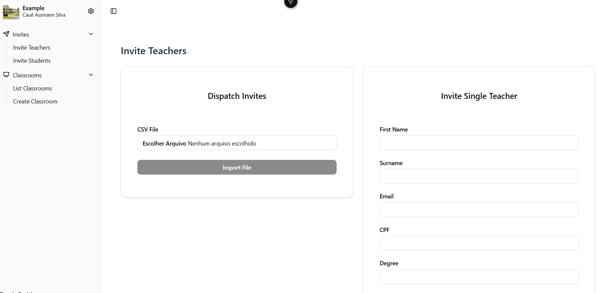

# Teach Smith – Frontend

Interface web do sistema **Teach Smith**, desenvolvida com [Vue 3](https://vuejs.org/) + [Vite](https://vitejs.dev/).



## 🧾 Sobre o Projeto

Plataforma de gestão educacional com foco em:

- Organização de turmas, alunos e professores  
- Cadastro de organizações  
- Acesso com autenticação via Google ou formulário  
- Interface moderna, responsiva e funcional  

Este projeto é parte de uma aplicação full-stack.

👉 Veja também o repositório do back-end:  
[🔗 Teach Smith API (Laravel)](https://github.com/assmannsilva/teach-smith-api)

## 🚀 Tecnologias

- **Vue 3** + **Vite**  
- **TypeScript**  
- **Pinia** – gerenciamento de estado  
- **Vue Router**  
- **Vitest** – testes unitários  
- **Docker** – ambiente containerizado  

## 📂 Estrutura

- src/
- components/ # Componentes reutilizáveis
- views/ # Páginas da aplicação
- api/ # Integração com backend
- services/ # Lógica de negócio
- stores/ # Estado global com Pinia
- types/ # Tipagens globais
- utils/ # Funções auxiliares


## ▶️ Executando Localmente

```bash
# Instalar dependências
npm install

# Rodar em modo desenvolvimento
npm run dev

# Build para produção
npm run build

# Ou com Docker
docker-compose up -d

```

Crie um arquivo .env e adicione 

``` bash
VITE_API_URL=http://localhost:8000/
```
👤 Autor
Desenvolvido por Cauê Assmann Silva